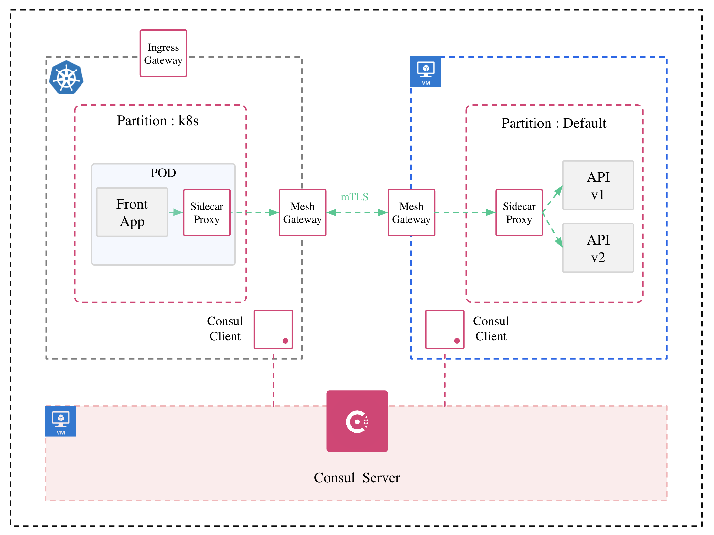
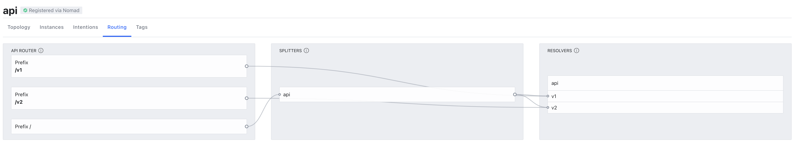

# Consul Service Mesh

- Hybrid 환경에서의 Consul 을 활용한 Service Mesh 구성 Demo
- VM 환경에 대해 구성편의를 위해 Nomad x Consul Integration 활용
- Consul Config Entries 를 비롯한 Policy 설정 관련 편의를 위해 Terraform x Consul Integration 활용


## 구성 환경

- 필요 Resource
  - Consul Server VM: Demo 에서는 1 Node, 실 운영환경에서는 HA 구성을 위해 3 Node 이상 구성 권장
  - Consul Client VM: 일반적인 VM 환경 (Container 기반 App 구동을 위해 Docker 사용)
  - K8S Cluster: Demo 에서는 Azure AKS (Worker Node: 2) 사용. Network CNI 의 경우 Azure CNI 사용
  - Consul Enterprise License: Admin Partition 등 Enterprise 기능 사용을 위해 필요. Test License 발급 가능 
    - Admin Partition 에 대한 이해: [Youtube - Consul Admin Partitions by Great-Stone](https://www.youtube.com/watch?v=BT0nQx-buIg) 참고
- 선택적 필요 Resource
  - Nomad: VM 환경에서 Consul Service Registry 및 Service Mesh 에 필요한 Envoy 기반 Gateway, Sidecar 설정에 대한 편의성을 위해 사용
  - Terraform: Consul Service Mesh 구성을 위해 수반되는 정책 관련 설정 관리 및 이력 관리에 대한 편의성을 위해 사용




## Server VM: 기본 설치 및 환경 구성

- [Consul](https://learn.hashicorp.com/tutorials/consul/deployment-guide?in=consul/production-deploy#install-consul) / [Nomad](https://learn.hashicorp.com/tutorials/nomad/get-started-install?in=nomad/get-started) 설치

  - Consul: https://learn.hashicorp.com/tutorials/consul/deployment-guide?in=consul/production-deploy#install-consul
  - Nomad: https://learn.hashicorp.com/tutorials/nomad/get-started-install?in=nomad/get-started
  - Hashicorp GPG Key 추가

  ```
  curl --fail --silent --show-error --location https://apt.releases.hashicorp.com/gpg | \
        gpg --dearmor | \
        sudo dd of=/usr/share/keyrings/hashicorp-archive-keyring.gpg
  ```

  - Hashicorp Repo 추가

  ```
  echo "deb [arch=amd64 signed-by=/usr/share/keyrings/hashicorp-archive-keyring.gpg] https://apt.releases.hashicorp.com $(lsb_release -cs) main" | \
   sudo tee -a /etc/apt/sources.list.d/hashicorp.list
   
  sudo apt-get update
  ```

  - Consul Enterprise / Nomad 설치

  ```
  sudo apt-get install consul-enterprise
  sudo apt-get install nomad
  ```

  - Consul Gossip Key 생성

  ```
  consul keygen
  
  7w+zkhqa+YD4GSKXjRWETBIT8hs53Sr/w95oiVxq5Qc=
  ```

  - Consul Config 작성 (/etc/consul.d/config.hcl)

  ```hcl
  # server
  server = true
  
  data_dir = "/opt/consul"
  datacenter = "dc1"
  client_addr = "0.0.0.0"
  bind_addr = "0.0.0.0" 
  advertise_addr = "10.0.0.4" # Server VM Private IP
  
  ui_config {
    enabled = true
  }
  
  # Enterprise License
  license_path = "/opt/consul/consul.hclic"
  
  # bootstrap_expect
  bootstrap_expect=1
  
  # gossip encrypt
  encrypt = "7w+zkhqa+YD4GSKXjRWETBIT8hs53Sr/w95oiVxq5Qc="
  
  # retry_join
  retry_join = ["10.0.0.4"] # Server VM Private IP
  
  verify_incoming = false
  verify_incoming_rpc = false
  verify_outgoing = false
  verify_server_hostname = false
  
  ports {
    http = 8500
    dns = 8600
    https = -1
    serf_lan = 8301
    grpc = 8502
    server = 8300
    serf_wan = 8302
  }
  
  # Service Mesh (Consul Connect) 위해 필요
  connect {
    enabled = true
  }
  
  log_level = "DEBUG"
  log_file = "/opt/consul/consul.log"
  log_rotate_duration = "24h"
  log_rotate_bytes = 104857600
  log_rotate_max_files = 100
  ```

  - Nomad Config (/etc/nomad.d/nomad.hcl)

  ```hcl
  # Full configuration options can be found at https://www.nomadproject.io/docs/configuration
  
  data_dir  = "/opt/nomad/data"
  bind_addr = "0.0.0.0"
  
  server {
    enabled          = true
    bootstrap_expect = 1
  }
  
  consul {
    address  = "10.0.0.4:8500"
    grpc_address = "10.0.0.4:8502"
    server_service_name = "nomad"
    client_service_name = "nomad-client"
    auto_advertise  = true
    server_auto_join  = true
    client_auto_join  = true
  }
  
  log_level = "DEBUG"
  log_file = "/opt/nomad/nomad.log"
  log_rotate_duration = "24h"
  log_rotate_bytes = 104857600
  log_rotate_max_files = 100
  ```

  - Consul / Nomad Service 등록 및 시작

  ```
  sudo systemctl enable consul
  sudo systemctl start consul
  
  sudo systemctl enable nomad
  sudo systemctl start consul
  ```


## Client VM: 기본 설치 및 환경 구성

- [Consul](https://learn.hashicorp.com/tutorials/consul/deployment-guide?in=consul/production-deploy#install-consul) / [Nomad](https://learn.hashicorp.com/tutorials/nomad/get-started-install?in=nomad/get-started) 설치

  - Consul: https://learn.hashicorp.com/tutorials/consul/deployment-guide?in=consul/production-deploy#install-consul
  - Nomad: https://learn.hashicorp.com/tutorials/nomad/get-started-install?in=nomad/get-started
  - Hashicorp GPG Key 추가

  ```
  curl --fail --silent --show-error --location https://apt.releases.hashicorp.com/gpg | \
        gpg --dearmor | \
        sudo dd of=/usr/share/keyrings/hashicorp-archive-keyring.gpg
  ```

  - Hashicorp Repo 추가

  ```
  echo "deb [arch=amd64 signed-by=/usr/share/keyrings/hashicorp-archive-keyring.gpg] https://apt.releases.hashicorp.com $(lsb_release -cs) main" | \
   sudo tee -a /etc/apt/sources.list.d/hashicorp.list
   
  sudo apt-get update
  ```

  - Consul Enterprise / Nomad 설치

  ```
  sudo apt-get install consul-enterprise
  sudo apt-get install nomad
  ```

  - Consul Config 작성 (/etc/consul.d/config.hcl)

  ```hcl
  # server
  server = false
  
  data_dir = "/opt/consul"
  datacenter = "dc1"
  client_addr = "0.0.0.0"
  bind_addr = "0.0.0.0" 
  advertise_addr = "10.0.0.5" # Server VM Private IP
  
  ui_config {
    enabled = true
  }
  
  #partition 은 기본값이 default 이므로 설정 불필요
  #partition 을 default로 하는 이유: 현재 Nomad 에서 Consul Admin Partition 지정 불가
  
  # Enterprise License
  license_path = "/opt/consul/consul.hclic"
  
  # bootstrap_expect
  bootstrap_expect=1
  
  # gossip encrypt (Server 에서 생성한 동일 key 입력)
  encrypt = "7w+zkhqa+YD4GSKXjRWETBIT8hs53Sr/w95oiVxq5Qc="
  
  # retry_join
  retry_join = ["10.0.0.4"] # Server VM Private IP
  
  verify_incoming = false
  verify_incoming_rpc = false
  verify_outgoing = false
  verify_server_hostname = false
  
  ports {
    http = 8500
    dns = 8600
    https = -1
    serf_lan = 8301
    grpc = 8502
    server = 8300
    serf_wan = 8302
  }
  
  # Service Mesh (Consul Connect) 위해 필요
  connect {
    enabled = true
  }
  
  log_level = "DEBUG"
  log_file = "/opt/consul/consul.log"
  log_rotate_duration = "24h"
  log_rotate_bytes = 104857600
  log_rotate_max_files = 100
  ```

  - Nomad Config (/etc/nomad.d/nomad.hcl)

  ```hcl
  # Full configuration options can be found at https://www.nomadproject.io/docs/configuration
  
  data_dir  = "/opt/nomad/data"
  bind_addr = "0.0.0.0"
  
  client {
    enabled = true
    servers = ["10.0.0.4"]
    
    # 필요에 따라 envoy version 지정
    meta {
     connect.sidecar_image = "envoyproxy/envoy:v1.21.3"
    }
  }
  
  consul {
    address  = "10.0.0.5:8500"
    grpc_address="10.0.0.5:8502"
    server_service_name = "nomad"
    client_service_name = "nomad-client"
    auto_advertise  = true
    server_auto_join  = true
    client_auto_join  = true
  }
  
  log_level = "DEBUG"
  log_file = "/opt/nomad/nomad.log"
  log_rotate_duration = "24h"
  log_rotate_bytes = 104857600
  log_rotate_max_files = 100
  ```

  - Consul / Nomad Service 등록 및 시작

  ```
  sudo systemctl enable consul
  sudo systemctl start consul
  
  sudo systemctl enable nomad
  sudo systemctl start consul
  ```

  - CNI Plugin 구성: Nomad 가 Service Mesh 를 위한 Sidecar Proxy 구성 시 사용할 CNI Plugin 구성
    - https://www.nomadproject.io/docs/integrations/consul-connect#cni-plugins

  ```
  curl -L -o cni-plugins.tgz "https://github.com/containernetworking/plugins/releases/download/v1.0.0/cni-plugins-linux-$( [ $(uname -m) = aarch64 ] && echo arm64 || echo amd64)"-v1.0.0.tgz
  sudo mkdir -p /opt/cni/bin
  sudo tar -C /opt/cni/bin -xzf cni-plugins.tgz
  ```

  - Container service 의 traffic 을 bridge network 를 통하도록 설정

  ```
  echo 1 | sudo tee /proc/sys/net/bridge/bridge-nf-call-arptables
  echo 1 | sudo tee /proc/sys/net/bridge/bridge-nf-call-ip6tables
  echo 1 | sudo tee /proc/sys/net/bridge/bridge-nf-call-iptables
  ```


## Client K8S: 기본 설치 및 환경 구성

- Install Consul on K8S from the Helm Chart: https://www.consul.io/docs/k8s/installation/install
- Consul 전용 Namespace 생성

```
kubectl create namespace consul
```

- "consul" Namespace 한정 Sidecar Injection 위한 Label 설정 (또는 Container 별 배포 yaml 에서 annotation 명시 )

```
kubectl label namespace consul connect-inject=enabled
```

- gossip encrypt key 를 secret 으로 등록 (secret name: consul-gossip-encryption-key)

```
kubectl create secret generic consul-gossip-encryption-key --from-literal=key=7w+zkhqa+YD4GSKXjRWETBIT8hs53Sr/w95oiVxq5Qc= -nconsul
```

- license key 를 secret 으로 등록

```
kubectl create secret generic license --from-literal=key={license-key} -nconsul
```

- Helm Repo 추가

```
helm repo add hashicorp https://helm.releases.hashicorp.com
```

- values.yaml
  - global.enabled:false - server 가 k8s 외부에 있으므로 client 만 개별 enable
  - adminPartitions.name:k8s - K8S 환경에 대한 Admin Partition 지정 (partition name: k8s)
  - connectInject.enabled:true - Service Mesh 기능 활성화
  - meshGateway.enabled:true - Mesh Gateway 활성화 (type: Load Balancer)
  - ingressGateway.enabled:true - Ingress Gateway 활성화 (type: Load Balancer, 사용할 port 명시 필요) 

```yaml
global:
  enabled: false
  datacenter: dc1
  logLevel: "debug"
  logJSON: false
  image: hashicorp/consul-enterprise:1.12.3-ent
  gossipEncryption:
    secretKey: key
    secretName: consul-gossip-encryption-key
  tls:
    enabled: false
  enableConsulNamespaces: true
  adminPartitions:
    enabled: true
    name: k8s
    service:
      type: LoadBalancer
  imageEnvoy: envoyproxy/envoy:v1.21.3-latest
  enterpriseLicense:
    secretName: license
    secretKey: key
externalServers:
  enabled: true
  httpsPort: 8500
  hosts:
  - '10.0.0.4'
  k8sAuthMethodHost: https://ebay-k8s-dns-6e462fab.hcp.koreacentral.azmk8s.io:443
client:
  enabled: true
  join: 
  - '10.0.0.4'
  exposeGossipPorts: true
  extraConfig: |
    {
      "log_level": "DEBUG"
    }
  grpc: true
connectInject:
  enabled: true
controller:
  enabled: true
meshGateway:
  enabled: true
  replicas: 1
  service:
    type: LoadBalancer
ingressGateways:
  enabled: true
  gateways:
  - name: ingress-gateway
    service:
      type: LoadBalancer
      ports:
      - port: 5000
```

- 설치

```
helm install consul hashicorp/consul --namespace consul --values values.yaml
```

- 설치 및 구동 확인

```
kubectl get all -nconsul
```


## Client VM: Gateway 설정 및 Demo Service 배포 (Nomad)

- Consul Native Gateway 및 Sidecar 배포 방법: [consul.io - Consul Connect Envoy](https://www.consul.io/commands/connect/envoy) 참고
- Mesh Gateway (mesh-gw.nomad)

```hcl
job "mesh-gw" {
  datacenters = ["dc1"]
  group "mesh" {
    network {
      mode = "host"
      port "mesh" {
        static = 8443
      }
    }
    service {
      name = "mesh-gateway"
      port = 8443

      connect {
        gateway {
          mesh {}
          proxy {}
        }
      }
    }
  }
}
```

- Demo Service: Fake Service API v1 / v2

  - 동일한 API Service 두 개 배포, service.meta.version 의 값을 각각 v1 / v2 로 명시하여 서로 다른 version으로 구분
  - API V1 (backend-v1.nomad / backend-v2.nomad)

  ```hcl
  job "fake-api-v1" {
     datacenters = ["dc1"]
     group "fake-api-v1" {
       network {
         mode = "bridge"
       }
  
       service {
         name = "api"
         port = "9091"
         tags = ["v1"] #api v2 에 대해서는 v2 로 명시
         meta {
          version = "v1" #api v2 에 대해서는 v2 로 명시
         }
  
         connect {
           sidecar_service {}
         }
  	
  			 ## 추가 health check 가 필요한 경우 명시
         check {
          expose = true
          type = "http"
          name = "api-health"
          path = "/"
          interval = "10s"
          timeout = "3s"
         }
    
       }
  
       task "api" {
         driver = "docker"
         config {
           image = "nicholasjackson/fake-service:v0.23.1"
         }
         env {
              LISTEN_ADDR = "127.0.0.1:9091"
              NAME = "api-v1" #api v2 에 대해서는 api-v2 로 명시
              MESSAGE = "Response from API v1"
         }
       }
     }
   }
  ```

- nomad job 실행

```
nomad job run mesh-gw.nomad
nomad job run backend-v1.nomad
nomad job run backend-v2.nomad
```

- job 배포 확인

```
nomad job status
```


## Client K8S: Demo Service 배포

- Fake Service Front (front.yaml)
  - consul.hashicorp.com/connect-inject:true - Sidecar Proxy 활성화
  - consul.hashicorp.com/connect-service-upstreams: upstream service 지정
    - upstream service 가 다른 partition 에 있는 경우: service.namespace.partition:port 형태로 명시
    - https://www.consul.io/docs/k8s/annotations-and-labels#consul-hashicorp-com-connect-service-upstreams 

```yaml
apiVersion: v1
kind: ServiceAccount
metadata:
  name: web
---
apiVersion: v1
kind: Service
metadata:
  name: web
spec:
  selector:
    app: web
  ports:
    - port: 9090
      targetPort: 9090
---
apiVersion: apps/v1
kind: Deployment
metadata:
  name: web-deploy
  labels:
    app: web
spec:
  replicas: 1
  selector:
    matchLabels:
      app: web
  template:
    metadata:
      labels:
        app: web
      annotations:
        consul.hashicorp.com/connect-inject: 'true'
        consul.hashicorp.com/connect-service-upstreams: 'api.default.default:9091'
    spec:
      serviceAccountName: web-na
      containers:
        - name: web-na
          image: nicholasjackson/fake-service:v0.23.1
          ports:
            - containerPort: 9090
          env:
            - name: 'LISTEN_ADDR'
              value: '0.0.0.0:9090'
            - name: 'UPSTREAM_URIS'
              value: 'http://localhost:9091'
            - name: 'NAME'
              value: 'web'
            - name: 'MESSAGE'
              value: 'Hello World'
```

- 배포

```
kubectl apply -f front.yaml -nconsul
```


## Consul Server: Service Mesh - Gateway 설정 (Terraform)

- Consul Provider 설정
  - https://registry.terraform.io/providers/hashicorp/consul/latest/docs

```
provider "consul" {
  address    = "{Consul Server IP}:8500"
  datacenter = "dc1"
}
```

- Proxy Defaults 설정
  - https://www.consul.io/docs/connect/config-entries/proxy-defaults
  - Cluster 또는 Partition 에 구성된 Mesh Gateway 들의 동작 방식 지정
  - MeshGateway 에 대해
    - local: 동일 DC 내 partition 간 통신
    - remote: 서로 다른 DC 간 통신

```
resource "consul_config_entry" "proxy_defaults" {
  kind = "proxy-defaults"
  # Note that only "global" is currently supported for proxy-defaults and that
  # Consul will override this attribute if you set it to anything else.
  name = "global"

  config_json = jsonencode({
    MeshGateway = {
      Mode = "local"
    }
    Config = {
      Protocol = "http"
    }
  })
}
```

- Exported Services 설정

  - https://www.consul.io/docs/connect/config-entries/exported-services
  - 다른 Partition 또는 Data Center 에 Service 를 노출시킴으로써 Mesh Gateway 간 Routing 지원
  - k8s partition
    - web service 에 대해 default (vm) partition 에 노출 

  ```
  resource "consul_config_entry" "exported_services_k8s" {
      name = "k8s"
      kind = "exported-services"
      partition = "k8s"
      config_json = jsonencode({
          Services = [{
              Name = "web"
              Namespace = "default"
              Consumers = [{
                  Partition = "default"
              }]
          }]
      })
  }
  ```

  - default (vm) partition
    - api service 에 대해 k8s partition 에 노출

  ```
  resource "consul_config_entry" "exported_services_vm" {
      name = "default"
      kind = "exported-services"
      partition = "default"
      config_json = jsonencode({
          Services = [{
              Name = "api"
              Namespace = "default"
              Consumers = [{
                  Partition = "k8s"
              }]
          }]
      })
  }
  ```

- Ingress Gateway 설정

  - https://www.consul.io/docs/connect/config-entries/ingress-gateway
  - 외부에서 Service Mesh Network 로의 진입 시 활용되는 인입점 
  - 여러 service 에 대한 외부 인입점 개방 필요할 경우 port 를 여러개 설정해서 사용
  - TCP 5000 으로 k8s partition 에 구성된 web service 에 대한 Listener 설정
  - Hosts 의 경우 특정 host domain 정보가 있을 경우 명시 (예: web.example.com)

  ```
  resource "consul_config_entry" "ingress_gateway" {
    name = "ingress-gateway"
    kind = "ingress-gateway"
    namespace = "default"
    partition = "k8s"
    config_json = jsonencode({
      Listeners = [
      {
        Port     = 9090
        Protocol = "http"
        Services = [{ Name  = "web", Hosts = ["*"]}]
      }
      ]
    })
  }
  ```

- 적용

  - terraform apply

  ```
  terraform apply
  ```


## Consul Server: Service Mesh - Service 설정 (Terraform)

- Service Defaults 설정

  - https://www.consul.io/docs/connect/config-entries/service-defaults
  - Service Mesh Network 내 Service 에 대한 정의
  - web
    - MeshGateway.Mode = "local": Partition 간 통신으로 Mesh Gateway 사용
    - passive_health_check: web 의 upstream service 에 대한 이상 감지 위한 health check. 이상 감지 시 circuit breaking 발동 및 해당 service eject

  ```
  resource "consul_config_entry" "web-consul" {
    name = "web-consul"
    kind = "service-defaults"
    partition = "default"
    config_json = jsonencode({
          Protocol = "http"
          Namespace = "default"
          UpstreamConfig = {
              Defaults = {
                  MeshGateway = {
                      Mode = "local"
                  }
                  passive_health_check = {
                      interval     = "30s"
                      max_failures = 5
                  }
              }
          }
    })
  }
  ```

  - api
    - MeshGateway.Mode = "local": Partition 간 통신으로 Mesh Gateway 사용

  ```
  resource "consul_config_entry" "api" {
    name = "api"
    kind = "service-defaults"
    partition = "default"
    config_json = jsonencode({
          Protocol = "http"
          Namespace = "default"
          UpstreamConfig = {
              Defaults = {
                  MeshGateway = {
                      Mode = "local"
                  }
              }
          }
    })
  }
  ```

- 적용

  - terraform apply

  ```
  terraform apply
  ```


## Consul Server: Service Mesh - L7 Routing 설정 (Terraform)



- Service Router
  - https://www.consul.io/docs/connect/config-entries/service-router
  - HTTP 로 동작하는 Service 또는 Proxy-defaults 기반 global 로 정의된 Service 한정 
  - Path Mapping, Query Mapping 또는 HTTP Header 정보 등을 Matching 해서 Routing

```
resource "consul_config_entry" "service_router" {
  kind = "service-router"
  name = "api"

  config_json = jsonencode({
    Routes = [
      {
        Match = {
          HTTP = {
            PathPrefix = "/v1"
          }
        }

        Destination = {
          Service = "api"
          Partition = "default"
          ServiceSubset = "v1"
        }
      },
      {
        Match = {
          HTTP = {
            PathPrefix = "/v2"
          }
        }

        Destination = {
          Service = "api"
          Partition = "default"
          ServiceSubset = "v2"
        }
      },
      {
        Match = {
          HTTP = {
            queryParam = {
              name = "version"
              exact = "v1"
            }
          }
        }

        Destination = {
          Service = "api"
          Partition = "default"
          ServiceSubset = "v1"
        }
      },
      {
        Match = {
          HTTP = {
            queryParam = {
              name = "version"
              exact = "v2"
            }
          }
        }

        Destination = {
          Service = "api"
          Partition = "default"
          ServiceSubset = "v2"
        }
      }      
      # NOTE: a default catch-all will send unmatched traffic to "web"
    ]
  })
}
```

- Service Splitter
  - https://www.consul.io/docs/connect/config-entries/service-splitter
  - Inbound Traffic 에 대한 분산 비율 정책
  - HTTP 로 동작하는 Service 또는 Proxy-defaults 기반 global 로 정의된 Service 한정 

```
resource "consul_config_entry" "service_splitter" {
   kind = "service-splitter"
   name = "api"
   config_json = jsonencode({
     Splits = [
     {
        Weight        = 0
        ServiceSubset = "v1"
     },
     {
        Weight        = 100
        ServiceSubset = "v2"
     },
     ]
   })
}
```

- Service Resolver
  - https://www.consul.io/docs/connect/config-entries/service-resolver
  - Inbound Traffic 에 대해 어떤 식으로 처리할 지에 대한 Filter 설정
  - 일반vm 에서 service-resolver / k8s 에서 ServiceResolver 
  - 예: Version 에 따른 Filter

```
resource "consul_config_entry" "service_resolver" {
  kind = "service-resolver"
  name = "api"

  config_json = jsonencode({

    Subsets = {
      "v1" = {
        Filter = "Service.Meta.version == v1"
      }
      "v2" = {
        Filter = "Service.Meta.version == v2"
      }
    }
  })
}
```

- 적용

  - terraform apply

  ```
  terraform apply
  ```